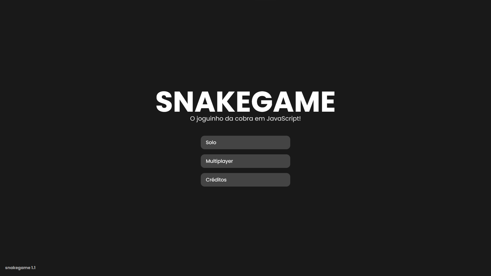
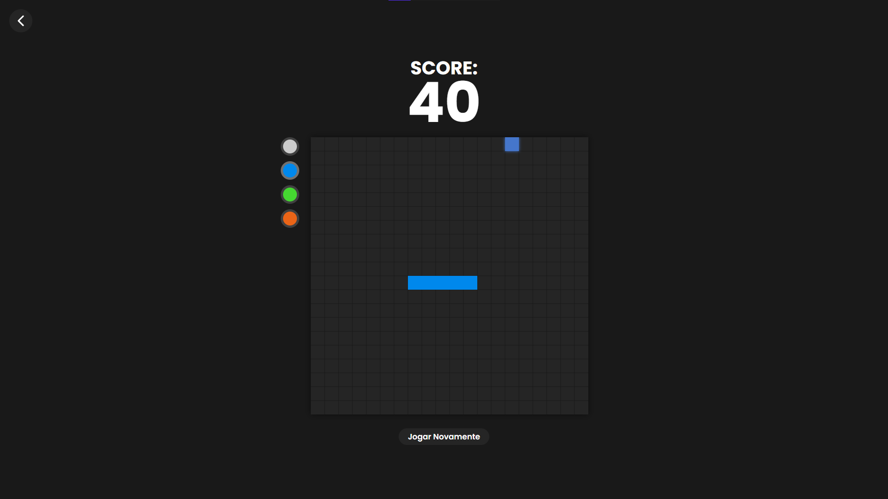
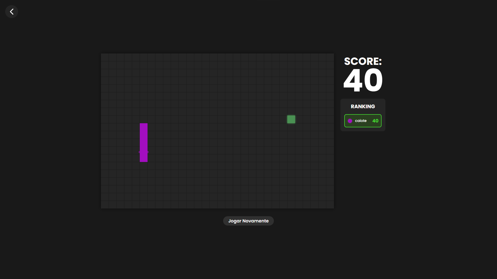

# SNAKEGAME 

O jogo da cobrinha classico feito em Html, Css e JavaScript, feito com intuito de estudos! Também com versão multiplayer usando WebSocket.
Clone o repositório ou acesse o deploy para jogar:<br/>
https://snakegame-one-opal.vercel.app

## Capturas de Telas

|  |  |  |

## Objetivos

Este projeto nasceu de uma vontade de aprender e evoluir. Os principais objetivos por trás dele são:

- Aprofundar o entendimento de JavaScript puro, manipulação de Canvas, game loops e comunicação em tempo real com WebSocket
- Demonstrar capacidade de construir uma aplicação completa do zero, com frontend, servidor HTTP e servidor WebSocket integrados
- Disponibilizar o código de forma aberta para que outras pessoas possam estudar, contribuir e se inspirar

### Servidores

- **HTTP Server**: Porta 3000 (servindo os arquivos HTML/CSS/JS)
- **WebSocket Server**: Porta 8080 (gerenciando o jogo multiplayer)

## Dependências

O projeto foi desenvolvido com as seguintes dependências:

- **[HTML](https://svelte.dev)** – HTML5
- **[CSS](https://vite.dev)** – CSS3
- **[JavaScript](https://threejs.org)** – ECMAScript 2024
- **WebSocket** - (biblioteca `ws` para comunicação em tempo real)
- **[Node.js](https://nodejs.org/pt)** para os servidores

## Como Rodar Localmente

### Pré-requisitos

- [Node.js](https://nodejs.org) instalado

### 1. Clone o repositório

```bash
git clone https://github.com/seu-usuario/snakegame.git
cd snakegame
```

### 2. Instale as dependências

```bash
npm install
```

### 3. Inicie os servidores

Em dois terminais separados:

```bash
# Terminal 1 — servidor HTTP
node server.js

# Terminal 2 — servidor WebSocket (multiplayer)
node js/multiplayer/server.js
```

### 4. Acesse no navegador

```
http://localhost:3000
```

by caiothevisual  
#caiobavisuals #snakegame #html #css #javascript